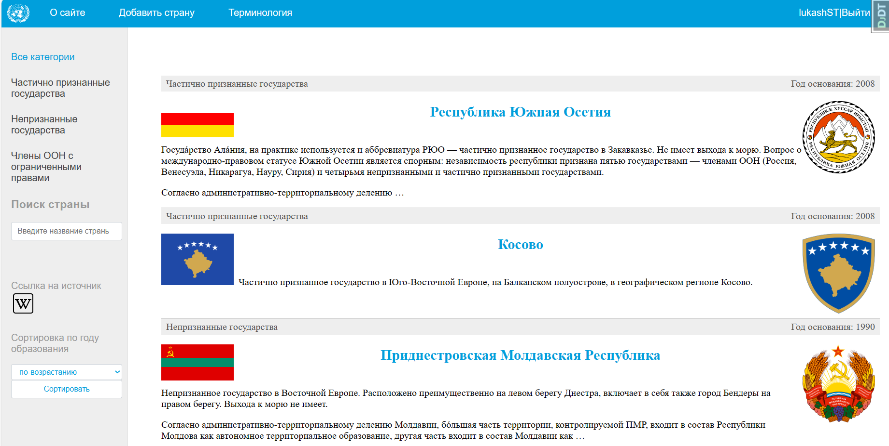

<h1>Noncountries</h1>

<h4> Application description</h4>
This is a pat project which is dedicated to unrecognized countries. 


<li>Base django authentication system</li>
<li>Possibility to add new countries by an authorized user
<li>Possibility to sort content by foundation year of country
<li>Possibility to sort content by its category
<li>Possibility to search content by its title
<li>Pagination, that depends on sorting
<li>Performance optimization using cache of redis-server

<ui><h4>Basic frameworks and libraries:</h4></ui>
<li> Django
<li> redis-server
<li> psycopg2
<li> bootstrap


<h4>Screen of application</h4>




<h4>Steps to activate the project on linux machine:</h4>
<p> 1. Clone git repository to your machine:</p>

```
git clone https://github.com/lukash-ST88/Noncountries.git
```

<p> 2. Create and activate virtual environment: </p>

```
python -m venv [name]

source [name]/bin/activate
```
<p>3. Install all requirements: </p>

```
pip install -r requirements.txt 
```
<p> 4. Create .env file and fill it with your own database and backend data: </p>

```
SECRET_KEY=some-secret-key

ALLOWED_HOSTS=127.0.0.1 localhost

POSTGRES_ENGINE=django-backend
POSTGRES_USER=user
POSTGRES_PASSWORD=pass
POSTGRES_HOST=localhost
POSTGRES_PORT=5432
POSTGRES_NAME=name
```

<p>5. Install [redis-server](https://www.digitalocean.com/community/tutorials/how-to-install-and-secure-redis-on-ubuntu-20-04) on linux machine and start it then:</p>
 
```
sudo service redis-server start
```
<p> 6. Migrate data to database:</p>

```
cd noncountries
python3 manage.py migrate
```

<p> 7. Run the application: </p>

```
python3 manage.py runserver
```
